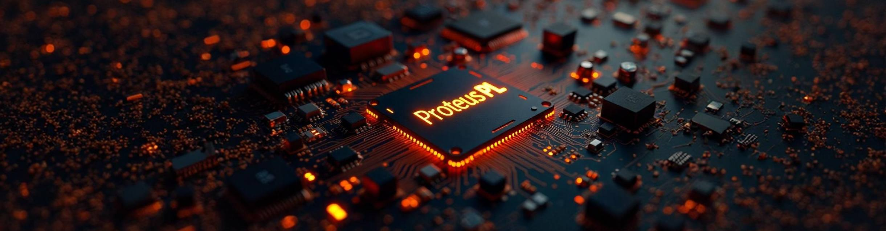

# Psid2cpp
Initial version of Simple Converter. 
You might ask, who needs a program like this? I do ;).  

While writing a Commodore C64 music player for an STM32 or ESP32, I needed to quickly test the code. Without SD card support, it was difficult to simply load data into memory. 
And this converted file was perfect for that. 
Of course, the file itself isn't everything. Support for a virtual 6502 processor, which will emulate the C64 processor, needs to be added.

Initial version of Simple Converter
More info on <a href="https://proteuspl.blogspot.com/2025/10/zabawa-z-plikami-dzwiekowymi-z-c64.html">My Blogspot.</a>
